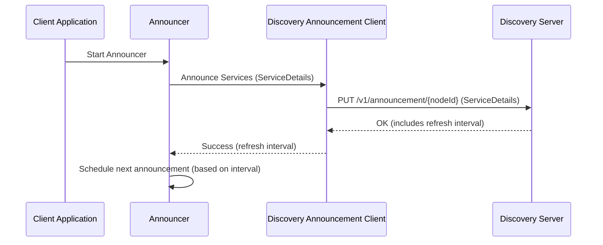
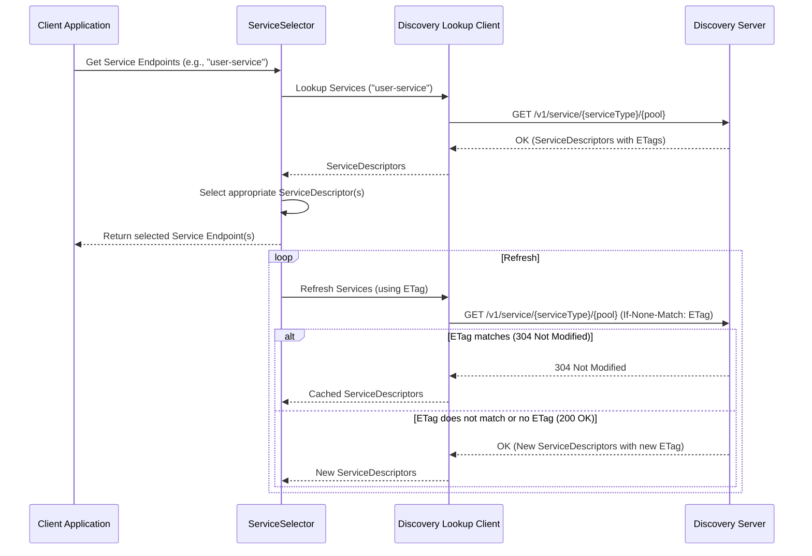

# Discovery Client Module

This module provides client-side functionality for service discovery in a distributed system. It allows services to announce their presence and discover other services.

## Core Components

The discovery client has three main components:

1.  **`Announcer`**: Responsible for announcing the services provided by the local application instance to the discovery server. It periodically sends out announcements containing details about each service, such as its type, properties, and location.

2.  **`DiscoveryLookupClient`**: Used to query the discovery server for available instances of a specific service type. It can look up services globally or within a specific pool. The client handles communication with the server and caches responses to improve efficiency.

3.  **`ServiceSelector`**: Provides a mechanism to select one or more service instances from the list of available services retrieved by the `DiscoveryLookupClient`. Different selection strategies can be implemented (e.g., round-robin, random).

## Discovery Protocol

The discovery protocol involves two primary interactions: **Announcement** and **Lookup**.

### Announcement Process

Services use the announcement process to register themselves with the discovery server.



1.  The **Client Application** initializes and starts the `Announcer`.
2.  The `Announcer` gathers information about the services to be announced (e.g., service type, properties, address, port).
3.  It uses the `DiscoveryAnnouncementClient` (typically `HttpDiscoveryAnnouncementClient`) to send an announcement to the **Discovery Server**.
4.  The announcement is usually an HTTP PUT request to a specific endpoint (e.g., `/v1/announcement/{nodeId}`), containing the service details in the request body.
5.  The **Discovery Server** registers the service and responds with a success status and often a suggested refresh interval.
6.  The `Announcer` schedules the next announcement based on this interval. This process repeats periodically to ensure the discovery server has up-to-date information and to prevent stale registrations.
7.  When the application shuts down, the `Announcer` sends an unannounce request (e.g., HTTP DELETE) to the Discovery Server to remove its registrations.

### Lookup Process

Clients use the lookup process to find available instances of a particular service.



1.  The **Client Application** requests a `ServiceSelector` for a specific service type (and optionally a pool).
2.  The `ServiceSelector` uses the `DiscoveryLookupClient` (typically `HttpDiscoveryLookupClient`) to query the **Discovery Server**.
3.  The lookup is usually an HTTP GET request to an endpoint like `/v1/service/{serviceType}` or `/v1/service/{serviceType}/{pool}`.
4.  The **Discovery Server** responds with a list of `ServiceDescriptor` objects that match the query. This response includes an ETag for caching purposes.
5.  The `DiscoveryLookupClient` returns the `ServiceDescriptors` to the `ServiceSelector`.
6.  The `ServiceSelector` then applies its selection logic (e.g., pick one randomly, or return all) and provides the chosen service instance(s) to the Client Application.
7.  For subsequent lookups or refreshes, the `DiscoveryLookupClient` can include the ETag from the previous response in an `If-None-Match` header. If the service information hasn't changed, the server responds with a `304 Not Modified`, and the client uses its cached data. Otherwise, it receives the updated list and a new ETag.

## Configuration

The primary configuration for the discovery client is the URI of the discovery server. This is typically set via a configuration property like `discovery.uri`.

```java
// Example configuration in a properties file
discovery.uri=http://localhost:8080
```

The `DiscoveryClientConfig` class is responsible for holding this configuration.
