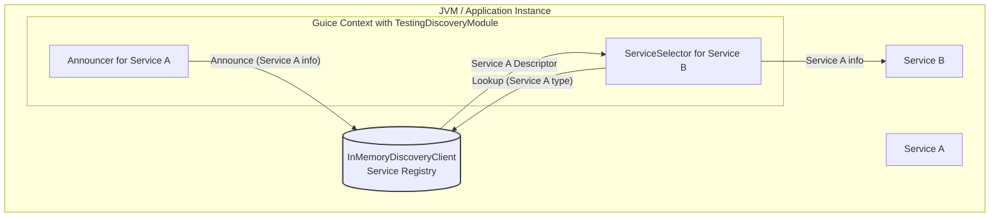

# Embedded Discovery with InMemoryDiscoveryClient

While the primary mode of operation for Airlift's discovery client is to interact with an external discovery server (as detailed in `README.md`), Airlift also provides a mechanism for *embedded discovery* primarily suited for testing and simple, single-process deployments. This is achieved using the `InMemoryDiscoveryClient` and `TestingDiscoveryModule`.

## Concept

The `InMemoryDiscoveryClient` acts as a lightweight, in-memory replacement for an external discovery server. It implements both the `DiscoveryAnnouncementClient` and `DiscoveryLookupClient` interfaces. This means it can:

1.  **Accept service announcements**: Services within the same Java Virtual Machine (JVM) can announce their presence to it.
2.  **Serve service lookups**: Other services (or even the same services) within that JVM can query it to find registered services.

This allows different components or services running within the same application instance to discover each other without any network overhead or the need to set up an external discovery server.

## How it Works

The `TestingDiscoveryModule` is a Guice module that configures the standard discovery components (`Announcer`, `ServiceSelectorFactory`, etc.) to use a single instance of `InMemoryDiscoveryClient`.

*   When a service in your application (that has the `TestingDiscoveryModule` installed) starts its `Announcer`, the announcements are sent to the `InMemoryDiscoveryClient`.
*   The `InMemoryDiscoveryClient` stores these announcements as `ServiceDescriptor` objects in an internal, in-memory collection.
*   When a `ServiceSelector` in your application attempts to look up services, it queries the same `InMemoryDiscoveryClient` instance, which then returns matching `ServiceDescriptor`s from its internal collection.



In the diagram above:
1. `Service A` uses its `Announcer` (configured by `TestingDiscoveryModule`) to announce itself.
2. The announcement goes to `InMemoryDiscoveryClient`.
3. `Service B` uses its `ServiceSelector` (also configured by `TestingDiscoveryModule`) to look for services of `Service A`'s type.
4. The lookup query goes to the same `InMemoryDiscoveryClient`.
5. `InMemoryDiscoveryClient` returns the descriptor for `Service A`.
6. `Service B` now knows how to connect to `Service A`.

## Usage

To use this embedded discovery mechanism, you would typically include the `TestingDiscoveryModule` in your Guice injector configuration, especially during testing or for specific deployment scenarios.

```java
// Example Guice setup
Injector injector = Guice.createInjector(
    new TestingDiscoveryModule(),
    // ... other application modules
    new ServiceAModule(), // Module that might announce ServiceA
    new ServiceBModule()  // Module that might look up ServiceA
);

// Announcer will be started automatically if bound, or can be started manually.
// ServiceSelectors can be injected and used to find services.
```

### Simulating External Services

The `InMemoryDiscoveryClient` also provides a method `addDiscoveredService(ServiceDescriptor serviceDescriptor)` which allows you to manually add service descriptors to its registry. This is useful in tests to simulate the presence of other services that are not actually running within the same JVM but whose presence you want to mock for testing discovery logic.

## Key Characteristics and Limitations

*   **Single JVM**: All announcements and lookups happen within the same JVM. It is not a distributed discovery solution.
*   **Testing Focus**: While it can be used for very simple single-node "micro-clusters" running in one process, its primary design goal is to facilitate testing of services that rely on discovery, without the overhead of an external server.
*   **No Network Traffic**: All operations are in-memory, making it very fast.
*   **No Persistence**: Service registrations are lost when the JVM shuts down.
*   **No Health Checking**: Unlike production discovery servers, `InMemoryDiscoveryClient` does not actively health check services. It relies on services to unannounce themselves (e.g., via `Announcer#destroy()`).

## Relationship to Client-Server Discovery

The `InMemoryDiscoveryClient` and `TestingDiscoveryModule` effectively simulate the server-side of the discovery protocol described in the main `README.md`, but do so entirely in memory. The client-side components (`Announcer`, `ServiceSelector`) interact with `InMemoryDiscoveryClient` using the same interfaces (`DiscoveryAnnouncementClient`, `DiscoveryLookupClient`) as they would with an `HttpDiscoveryAnnouncementClient` or `HttpDiscoveryLookupClient` that talks to an external server.

This makes it an excellent tool for testing your service's integration with the discovery system, as you can verify that your announcements are correctly formatted and your lookup logic behaves as expected, without external dependencies.
